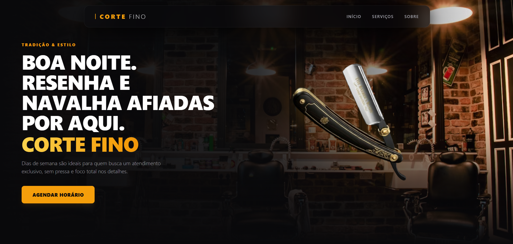

# 💈 Corte Fino Studio

O **Corte Fino Studio** é uma plataforma institucional moderna desenvolvida para barbearias de alto padrão que prezam pela excelência e estilo. O projeto combina um design minimalista, com paleta escura e detalhes em âmbar, com uma experiência de usuário fluida e animações de alta fidelidade.

Este repositório contém a interface da página principal (Landing Page), incluindo componentes dinâmicos, transições de carregamento cinematográficas e um sistema de design responsivo.

<div align="center">
  
</div>

<br />

<div align="center">
  <h3>
    "Onde o clássico encontra a precisão. Barbearia de alta performance."
  </h3>
  
[](https://barbershopcortefino.vercel.app/)
</div>

---

### ✨ Destaques de UI/UX

* **Preloader Cinemático:** Uma tela de boas-vindas com um *Barber Pole* (poste de barbeiro) minimalista flutuante, que gira de forma infinita e flui suavemente para revelar o site.
* **Transições Suaves:** Todo o site surge com um efeito de "foco" (blur para nítido) e escala assim que o carregamento termina.
* **Design Premium:** Paleta de cores inspirada em luxo e tradição, usando sombras profundas, *glassmorphism* na Navbar e tipografia limpa.

---

## 🛠️ Tecnologias Utilizadas

   

---

## 🚀 Como Iniciar o Projeto

### Pré-requisitos

Antes de começar, você precisará ter o [Node.js](https://nodejs.org/) instalado em sua máquina.

### Instalação e Execução

1.  **Clone este repositório:**
    ```bash
    git clone https://github.com/Rayck4dev/Corte-Fino-Barbearia.git
    ```

2.  **Acesse a pasta do projeto:**
    ```bash
    cd corte-fino-website
    ```

3.  **Instale as dependências:**
    ```bash
    npm install
    # ou
    yarn install
    ```

4.  **Inicie o servidor de desenvolvimento:**
    ```bash
    npm run dev
    # ou
    yarn dev
    ```

5.  Acesse `http://localhost:5173` no seu navegador para ver o resultado.

---

| Desenvolvido por DevLab © 2026 
